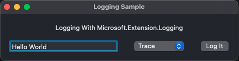
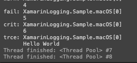
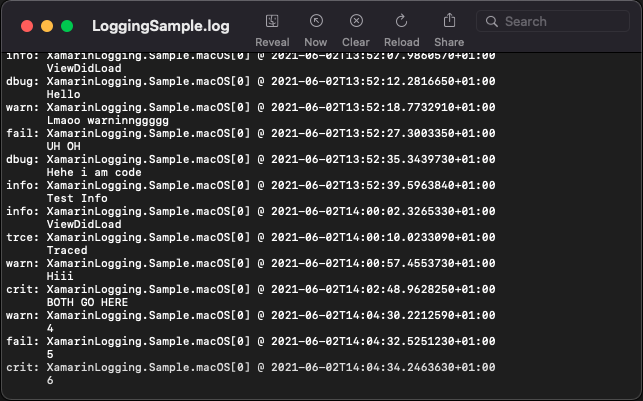

# Xamarin Microsoft Logging Sample

Sample project demonstrating Logging in Xamarin using the modern `Microsoft.Extensions.Logging` library

This project currently only contains a sample for native mac (Xamarin.Mac) since that was the platform I required logging on and didn't fancy maintaining my own framework.

This sample allows for full configuration from `Microsoft.Extensions.Logging` using `appsettings.json`.

## Required Packages

The following packages will need to be installed to your project in order to get file logging working. For the iOS & Android apps you can get away with only referencing them in the shared project but the mac project must reference them.

- `Microsoft.Extensions.Logging`
- `Microsoft.Extensions.Configuration`
- `Microsoft.Extensions.Configuration.Json`
- `Microsoft.Extensions.Logging.Console`
- `Karambolo.Extensions.Logging.File`

## Preview

Here are the results:

**Sample macOS App**

**Console Output**

**Log File Output**

## Native Setup

This sample is quite rough around the edges and should definitely not be used in production code. I have refined the code myself since I have used this as part of a custom logging solution in another project.

- Install NuGet Packages
- Create `app settings.json`:
  - Set **Build Action** to **Content**
  - Enable **Copy To Output Directory**
  - Populate with whatever settings you need
- Create the `ILogger` instance using the bootstrapping code you're familiar with in .NET 5+
- Register the `ILogger` or create another class that creates / provides it so you can pass it around your app (this is the part which needs more thought since we aren't using the .NET 5/Core DI).

